<h1 align="center">Hi 👋, I'm Md. Abdullah Al Mamun</h1> 
 

  <b>Computer Science & Engineering Student · Digital Business & Technology Enthusiast · Founder "The Personalist"</b>

  

  
  
  
  
  

---

## About Me

I'm a Computer Science and Engineering student with a focus on technology, digital business, and entrepreneurship. Alongside my academic work, I have practical experience in e-commerce operations, website management, inventory management, and digital business strategy.

I currently work in e-commerce while developing **The Personalist**, an upcoming personal care e-commerce venture centered on authentic imported personal care products. I'm also expanding my technical skill set in **C/C++, PHP, SQL, WordPress, and web development**.

---

## Current Focus

- Studying Computer Science & Engineering
- Strengthening programming and database skills
- Managing e-commerce operations
- Exploring technology, digital business, and entrepreneurship
- Building **The Personalist**
- Developing personal and university projects

---

## Technical Skills

**Languages**

**Database**

**Web & E-commerce**

**Tools**

---

## GitHub Stats

  
  

---

## Featured Projects

| Project | Description | Stack |
|---|---|---|
| **Bus Koi** | University project focused on transport-related problem solving | C |
| **NUB To-Let Hub** | Platform for to-let and rental-related services | PHP, HTML, Oracle Database |
| **RedDrop** | Ongoing personal project building a practical digital solution | — |
| **HealthyLife Everyday** | Lifestyle tracker helping users monitor daily activity and build healthy habits | — |
| **StudGoods** | Student-focused tool for task management and daily goods organization | — |
| **Prayer & Good Tracking** | Personal development app for tracking prayers and positive habits | — |

---

## Entrepreneurial Venture

### The Personalist
**Founder — Upcoming Personal Care E-commerce Venture**

An upcoming personal care brand focused on authentic imported personal care products. Currently in progress:

- Brand development
- Business planning
- Digital presence
- E-commerce strategy

---

> *"Think deep. Code smart. Stay humble."* — Md. Abdullah Al Mamun
>
> *"Code is like humor. When you have to explain it, it's bad."* — Cory House

---

## Get in Touch

- **Email:** abd.al.maamun@gmail.com
- **LinkedIn:** [linkedin.com/in/a-al-mamun](https://linkedin.com/in/a-al-mamun)
- **GitHub:** [github.com/a-al-mamun-dev](https://github.com/a-al-mamun-dev)
- **Location:** Dhaka, Bangladesh

<i>Technology · Digital Business · Entrepreneurship</i>

